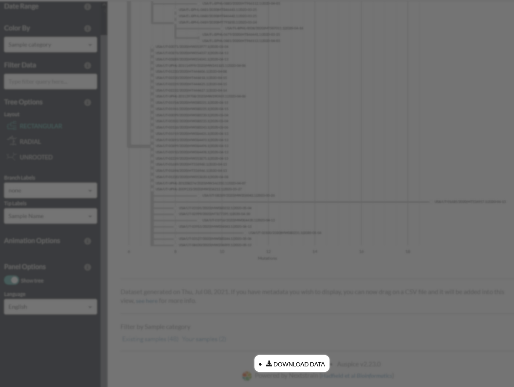

  

  private (<strong>Sh</strong>h :shushing_face:) <strong>U</strong>ltrafast <strong>S</strong>ample placement on <strong>E</strong>xisting t<strong>R</strong>ees</strong>

  
  
  
  
  <!---BEGIN_USHER_BADGE-->
 
<!---END_USHER_BADGE-->
 
  | :computer_mouse:	Access ShUShER <a target="_blank" href="https://shusher.gi.ucsc.edu">here</a>! |
| --- |

    ShUShER is a browser tool for placing sensitive genome sequences on phylogenetic trees using <a target="_blank" href="https://github.com/yatisht/usher">UShER</a>.
  <h3>
    <a href="#usage">
      Usage
    </a>
     | 
    <a href="#how-it-works">
      How it works
    </a>
     | 
    <a href="#installation-for-developers">
      Installation
    </a>
  </h3>

## Contents
- [Usage](#usage)
  - [Loading samples](#loading-samples)
  - [Running UShER](#running-usher)
  - [Interpreting results](#interpreting-results)
  - [Visualizing subtrees](#visualizing-subtrees)
  - [Downloading data](#downloading-data)
- [How it works](#how-it-works)
- [Installation](#installation-for-developers)
  - [Running the web app locally](#running-the-web-app-locally)
  - [Compiling UShER to WebAssembly](#compiling-usher-to-webassembly)
- [Contributing](#contributing)
- [About this repository](#about-this-repository)
- [Acknowledgements](#acknowledgements)

## Usage
> :warning:	This tool is intended to be used <strong>only for sequences that cannot be shared publicly</strong>. If you do not have this requirement, please use the [UShER web tool](https://genome.ucsc.edu/cgi-bin/hgPhyloPlace) and submit your sequences to an INSDC member institution (NCBI, EMBL-EBI, or DDBJ) and GISAID

ShUShER is currently designed for use with SARS-CoV-2 genomes. The user supplies a set of samples in FASTA or VCF format, and the provided samples are placed on a continuously growing global tree ([read more](https://www.biorxiv.org/content/10.1101/2021.04.03.438321v1)). After placement, subtrees containing user samples can be visualized (using [Auspice](https://docs.nextstrain.org/projects/auspice/en/stable/)).

### Loading samples
Samples can be provided to ShUShER in either FASTA (`.fa`, `.fasta`, `.fna`) or VCF format (`.vcf`).

All samples must be in a single file. When you load your samples into ShUShER, they will not be uploaded to our servers and the data will remain on your computer.

### Running UShER

After loading your samples, two input fields will appear:

  |  |
| --- |

The first field selects the existing tree to place your samples on. Currently, the only option is the global SARS-CoV-2 tree (maintained [here](https://hgdownload.soe.ucsc.edu/goldenPath/wuhCor1/UShER_SARS-CoV-2/)).

After UShER places your samples on the global tree, it will output subtrees containing your samples. The second field allows you to select how many closely-related samples from the global tree to include in each subtree.
### Interpreting results

After UShER has finished running, a table of information about your samples will be displayed.

Two numbers are reported for each sample:

>**Number of maximally parsimonious placements** is the number of potential placements in the tree with minimal parsimony score. A higher number indicates a less confident placement.

>**Parsimony score** is the number of mutations/changes that must be added to the tree when placing this sample. The higher the number, the more diverged the sample.

### Visualizing subtrees
Each sample in the table will have a button, e.g.

allowing you to open the subtree containing that sample in Auspice. The subtree visualization will open in a new browser tab (but data is not sent over the Internet).

### Downloading data
Newick files for each of the generated subtrees can be downloaded at the bottom of the Auspice visualization page.

## How it works

The ShUShER web app uses a ported version of UShER that can be run client-side in a web browser. The original C++ [code base](https://github.com/yatisht/usher) is compiled to WebAssembly with [Emscripten](https://emscripten.org/) and wrapped in a React frontend (read more about the port [here](https://github.com/amkram/shusher/tree/master/usher-port)). User-provided samples are not transmitted across the Internet, and computation is performed locally in the browser. We use a modified version of [Auspice](https://docs.nextstrain.org/projects/auspice/en/stable/) to display the subtrees computed by UShER. The visualization opens in a new browser tab, using [localStorage](https://developer.mozilla.org/en-US/docs/Web/API/Window/localStorage) to share data between tabs without transmitting any user data over the web.

FASTA to VCF conversion is performed by aligning each provided sample pairwise to the reference SARS-CoV-2 genome. The implementation of pairwise alignment is from [Nextclade](https://github.com/nextstrain/nextclade/blob/0ed4e6a1569dbd0b91e9d4861494e97861a11e7e/packages/web/src/algorithms/alignPairwise.ts).

## Installation (for developers)
>SHUShER currently only supports building on Linux systems, and has been tested on Ubuntu 20.04

If you would like to run ShUShER locally or modify the source, first download the source code, e.g.:
  
  `wget https://github.com/amkram/shusher/archive/refs/tags/latest.tar.gz`
  
  `tar xvzf latest.tar.gz`

The above command will download the latest tagged release of ShUShER. View all "Releases" in the right sidebar if you want to download a specific version. Alternately, cloning this repository will give you the latest, unreleased code, but may be unstable.

The downloaded source code contains code for building both the web app and the UShER port.

### Running the web app locally

Enter the `web-app` subdirectory and run

  `npm install`

To build the app, run

  `npm run build`
  
And to start the local server, run

  `npm start`
  
You should now be able to access ShUShER in your browser at `localhost:4000`

### Compiling UShER to WebAssembly

The directory `usher-port` contains the original C++ UShER code and a script that will compile it to WebAssembly. You only need to compile UShER yourself if you want to change the UShER source code. Otherwise, the web app will automatically use the most recent pre-compiled release from this repository.

#### 1. Install Dependencies

`sudo apt-get update`

`sudo apt-get install wget python3 build-essential cmake protobuf-compiler dh-autoreconf`

#### 2. Compile UShER 

`./installUbuntuWeb.sh`

This script will download the C++ library dependencies of UShER, make some modifications necessary for WebAssembly compilation, and then compile them using emscripten. Output in the `build` directory includes `usher.wasm`, `usher.js`, `usher.data`, and `usher.worker.js`, all of which are used by the ShUShER web app.

#### 3. Specify custom UShER code

By default, the web app grabs the latest tagged release of the WebAssembly UShER bundle from this repository. If you compiled UShER yourself using the above steps, you can tell ShUShER to use your compiled code instead.

In the `web-app` subdirectory, edit `package.json` and change the following line:

    config: {
      usherBundle: "latest"
    }

to

    config: {
      usherBundle: "[path to build output]"
    }

## Contributing
We welcome and encourage contributions to ShUShER from the community. If you would like to contribute, please read the contribution [guidelines](CONTRIBUTING.md) and [code of conduct](CODE_OF_CONDUCT.md).

## About this repository
`usher-port` contains the scripts and files needed to compile UShER to WebAssembly. See [here](https://github.com/amkram/shusher/tree/master/usher-port) for details on the process.

`web-app` contains the React application that uses the UShER port.

Twice a day, the UShER C++ source hosted in this repository is updated from the main [UShER repository](https://github.com/yatisht/usher).

Upon each push to the master branch, the integration test Github Action is run, which (1) compiles the latest source from the main UShER repo to a binary executable, (2) compiles UShER to WebAssembly with this repo's latest code, and (3) runs both on a sample file and compares the outputs, ensuring they are the same.

New releases are tagged periodically and pushed to the live web app.

## Acknowledgements
This project uses or adapts code from several open-source projects. We are grateful for their contributions.

Pairwise sequence alignment uses the implementation from [Nextclade](https://github.com/nextstrain/nextclade).

Visualization of subtrees is performed with [Auspice](https://github.com/nextstrain/auspice/blob/5132a1c1d063761eb02dc5434a8316c6d5be7085/docs/index.rst).

Scripts to modify the Auspice server are from [auspice.us](https://github.com/nextstrain/auspice.us).

Nextclade, Auspice, and auspice.us are part of the [Nextstrain](https://github.com/nextstrain) project.

The core functionality of this tool is a ported version of [UShER](https://github.com/yatisht/usher).
