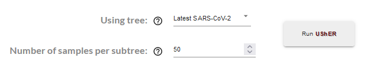

  

  private (<strong>Sh</strong>h :shushing_face:) <strong>U</strong>ltrafast <strong>S</strong>ample placement on <strong>E</strong>xisting t<strong>R</strong>ees</strong>

 

  | :computer_mouse:	Access ShUShER <a href="">here</a>! |
| --- |

    ShUShER is a browser tool for placing sensitive genome sequences on phylogenetic trees using <a href="https://github.com/yatisht/usher">UShER</a>.
  <h3>
    <a href="#usage">
      Usage
    </a>
     | 
    <a href="#how-it-works">
      How it works
    </a>
     | 
    <a href="#installation-for-developers">
      Installation
    </a>
  </h3>

## Contents
- [Usage](#usage)
  - [Loading samples](#loading-samples)
  - [Running UShER](#running-usher)
  - [Interpreting results](#interpreting-results)
  - [Visualizing subtrees](#visualizing-subtrees)
  - [Downloading data](#downloading-data)
- [How it works](#how-it-works)
- [Installation](#installation-for-developers)

## Usage
> :warning:	This tool is intended to be used <strong>only for sequences that cannot be shared publicly</strong>. If you do not have this requirement, please use the [UShER web tool](https://genome.ucsc.edu/cgi-bin/hgPhyloPlace) and submit your sequences to an INSDC member institution (NCBI, EMBL-EBI, or DDBJ) and GISAID

ShUShER is currently designed for use with SARS-CoV-2 genomes. The user supplies a set of samples in FASTA or VCF format, and the provided samples are placed on a continuously growing global tree ([read more](https://www.biorxiv.org/content/10.1101/2021.04.03.438321v1)). After placement, subtrees containing user samples can be visualized (using [Auspice](https://docs.nextstrain.org/projects/auspice/en/stable/)).

### Loading samples
Samples can be provided to ShUShER in either FASTA (`.fa`, `.fasta`, `.fna`) or VCF format (`.vcf`).

All samples must be in a single file. When you load your samples into ShUShER, they will not be uploaded to our servers and the data will remain on your computer.

### Running UShER

After loading your samples, two input fields will appear:

  |  |
| --- |

The first field selects the existing tree to place your samples on. Currently, the only option is the global SARS-CoV-2 tree (maintained [here](https://hgdownload.soe.ucsc.edu/goldenPath/wuhCor1/UShER_SARS-CoV-2/)).

After UShER places your samples on the global tree, it will output subtrees containing your samples. The second field allows you to select how many closely-related samples from the global tree to include in each subtree.
### Interpreting results

After UShER has finished running, a table of information about your samples will be displayed.

Two numbers are reported for each sample:

>**Number of maximally parsimonious placements** is the number of potential placements in the tree with minimal parsimony score. A higher number indicates a less confident placement.

>**Parsimony score** is the number of mutations/changes that must be added to the tree when placing this sample. The higher the number, the more diverged the sample.

### Visualizing subtrees
Each sample in the table will have a button, e.g.

allowing you to open that subtree in Auspice. The subtree visualization will open in a new browser tab (but data is not sent over the Internet).

### Downloading data
Newick files for each of the generated subtrees can be downloaded at the bottom of the Auspice visualization page.

## How it works

The ShUShER web app uses a ported version of UShER that can be run client-side in a web browser. The original C++ [code base]() is compiled to WebAssembly with [Emscripten]() and wrapped in a React frontend (read more about the port [here]()). User-provided samples are not transmitted across the Internet, and computation is performed locally in the browser. We use a modified version of [Auspice]() to display the subtrees computed by UShER. The visualization opens in a new browser tab, using [localStorage]() to share data between tabs without transmitting any user data over the web.

FASTA to VCF conversion is performed by aligning each provided sample pairwise to the reference SARS-CoV-2 genome. The implementation of pairwise alignment is from [Nextclade](https://github.com/nextstrain/nextclade/blob/0ed4e6a1569dbd0b91e9d4861494e97861a11e7e/packages/web/src/algorithms/alignPairwise.ts).

## Installation (for developers)

